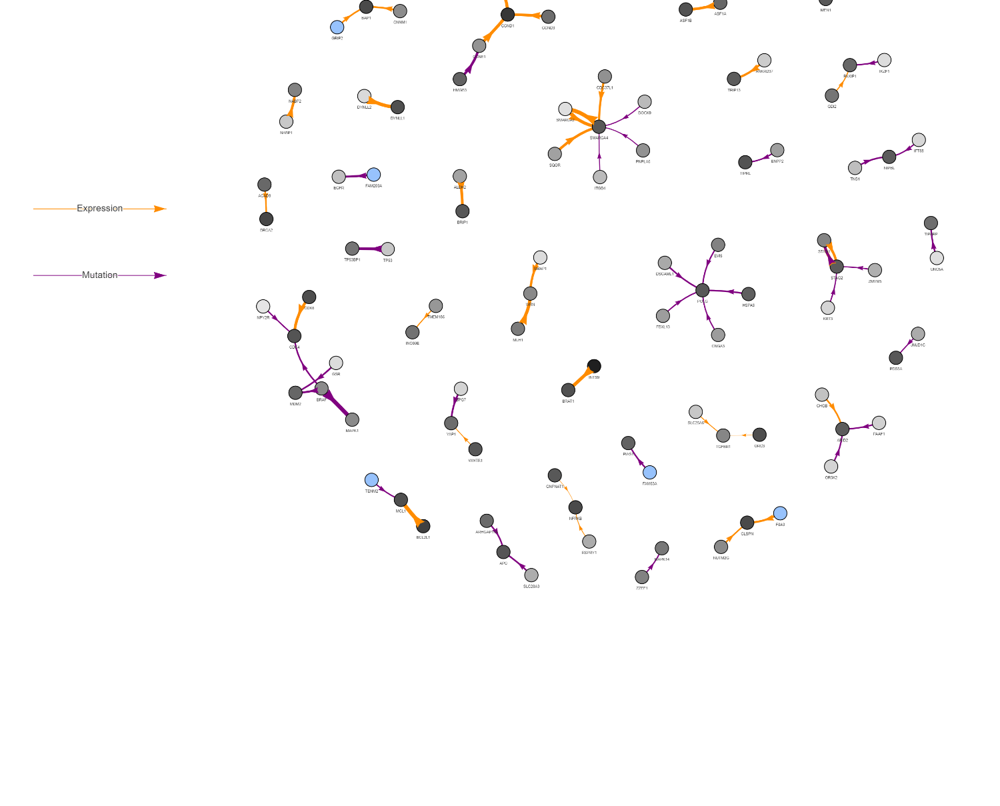

# 🧬 DDR Gene Network Shiny App

This is a Shiny web application to **visualize potential synthetic lethal (SL) interactions** between genes involved in **DNA Damage Repair (DDR)**. The app uses interactive **network plots** to display gene-gene relationships, with options to filter by source, importance score, and coefficient thresholds.

## 📸 Preview




**[DDR Shiny App Network View](https://github.com/OumaCavin/shiny-ddr-network/blob/main/resources/network.png)**.


## 🔗 Live Demo

👉 [Click here to launch the app on shinyapps.io](https://OumaCavin.shinyapps.io/shiny-ddr-network/)  


---

## 🗂️ Project Structure

```
shiny-ddr-network/
├── app.R                # The main Shiny app file
├── data/
│   ├── Selected_pairs.csv   # Network edges and gene importance scores
│   └── stats.csv            # Median dependency statistics for genes
└── README.md            # This file
```

---

## ⚙️ How to Run Locally

### 1. Clone the repository

```bash
git clone https://github.com/OumaCavin/shiny-ddr-network.git
cd shiny-ddr-network
```

### 2. Open R or RStudio and install required packages

```r
install.packages(c("shiny", "visNetwork", "tidyverse", "RColorBrewer"))
```

### 3. Run the app

```r
shiny::runApp()
```

---

## 📦 Required R Packages

- [shiny](https://cran.r-project.org/package=shiny)
- [visNetwork](https://cran.r-project.org/package=visNetwork)
- [tidyverse](https://www.tidyverse.org/)
- [RColorBrewer](https://cran.r-project.org/package=RColorBrewer)

---

## 📊 Data Descriptions

- **Selected_pairs.csv**  
  Contains gene-gene interaction data with group labels, coefficients, and importance scores.

- **stats.csv**  
  Contains statistical summaries such as median gene dependency scores, used to define node color in the network.

---

## 📥 Downloads in App

The app provides **download buttons** for:
- Filtered **network edge list**
- Filtered **node metadata** (e.g., median dependency)

---

## 🧬 About the Analysis

The goal is to identify context-specific SL interactions based on:
- **Gene expression ("e")** or **mutation ("m")**
- **Importance score types**: Gini, Permutation Raw, Gini Corrected
- **Dependency scores** used to determine node significance

---

## 🙌 Acknowledgements

Thanks to the bioinformatics community and all contributors of the data and tools used in this project.

---

## 📄 License

This project is open source under the [MIT License](LICENSE).

---
